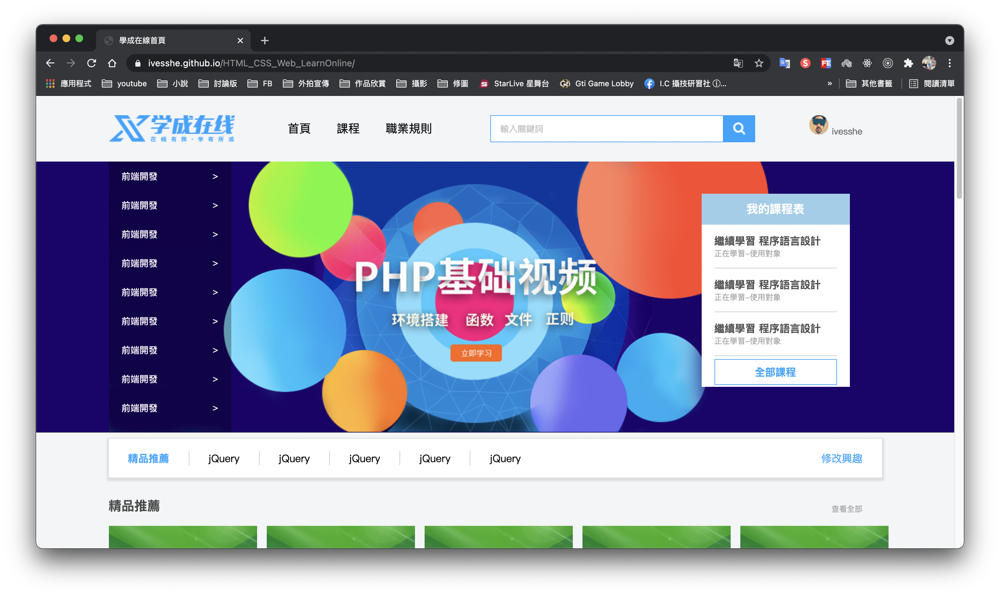

# HTML_CSS_Web 學成在線 網頁製作

# Github展示

本網頁製作為學習使習，若有侵權請告知，謝謝！

https://ivesshe.github.io/HTML_CSS_Web_LearnOnline/

# 頁面布局整體思路

為了提高網頁制作的效率，布局通常有以下的整體思路∶

1. 必須確定頁面的版心(可視區)，測量可得知
2. 分析頁面中的行模塊，以及每個行模塊中的列模塊，其為頁面布局的第一準則
3. 一行中的列模塊經常浮動布局，先確定每個列的大小，之後確定列的位置，其為頁面佈局的第二準則
4. 制作HTML結構，遵循先有結構、後有樣式的原則，結構永遠最重要 
5. 先理清楚布局結構，再寫代碼尤為重要，需要多寫多積累

# 導航欄

實際開發中，不會直接用鏈接a，而是使用li包鏈接(li+a)的作法

1. li + a 語意更清晰，一看就是有條理的列表型內容
2. 如果直接用a，搜尋引擎容易辨別為堆砌關鍵字的嫌疑(故意堆砌關鍵字容易被搜索引擎有降權的風險)，從而影響網站排名

# 完成畫面

